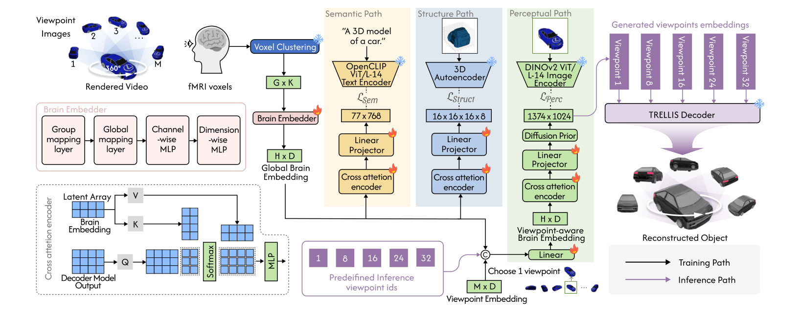

<div align="center">

# NeuroSculptor3D

### Single-Stage fMRI-to-3D Reconstruction via Viewpoint-Aware Embedding and Hierarchical Guidance

**AAAI 2026**

Xun Zhang<sup>1</sup>, Weihao Xia<sup>2</sup>, Yulong Liu<sup>3</sup>, Bo Yang<sup>4</sup>, Alessandro Bozzon<sup>1</sup>, Pan Wang<sup>1,&#42;</sup>

<sup>1</sup>Delft University of Technology &nbsp; <sup>2</sup>University of Cambridge &nbsp;
<sup>3</sup>The Hong Kong University of Science and Technology &nbsp; <sup>4</sup>The Hong Kong Polytechnic University

[**Paper**](https://ojs.aaai.org/index.php/AAAI/article/view/38864) &nbsp;|&nbsp; [**Data & checkpoints (Hugging Face)**](https://huggingface.co/datasets/tqxg2022/NeuroSculptor3D-data)

</div>

<p align="center"></p>

NeuroSculptor3D reconstructs **textured** 3D objects directly from fMRI recordings, trained end-to-end in a single
stage. Voxel responses are grouped into fixed-size clusters and embedded into global brain tokens, which are decoded
along three paths during training:

* **Perceptual path (viewpoint-aware)** - a learnable viewpoint embedding is fused with the brain tokens; a
  cross-attention encoder and a diffusion prior decode them into the DINOv2 tokens of the stimulus frame seen from that
  viewpoint.
* **Semantic path** - aligns the brain tokens with CLIP text tokens of the object category.
* **Geometric path** - predicts the TRELLIS sparse-structure latent of the object, supervised by MSE, a contrastive
  loss and a voxel Dice loss through the frozen TRELLIS decoder.

At inference the perceptual path decodes DINOv2 tokens for *d* viewpoints (default 5), which condition
[TRELLIS](https://github.com/microsoft/TRELLIS) in multi-view mode to produce 3D Gaussians, radiance fields and
textured meshes. The semantic and geometric paths act as training-time guidance only.

## News

* **2026-10** - Preprocessed data and the subject-1 checkpoint (`ss_sc_sub-0001`) released on [Hugging Face](https://huggingface.co/datasets/tqxg2022/NeuroSculptor3D-data); the other checkpoints will be added to the same repository.
* **2026-09** - Code released.

## Contents

* [Installation](#installation)
* [Data](#data)
* [Pretrained models](#pretrained-models)
* [Quick start](#quick-start)
* [Training](#training)
* [Inference](#inference)
* [Evaluation](#evaluation)
* [Repository structure](#repository-structure)
* [Citation](#citation)

## Installation

Requirements: Linux, an NVIDIA GPU with at least 24 GB of memory, the CUDA 11.8 toolkit and conda. Tested on
Ubuntu 22.04 with H100 and A100 GPUs.

```bash
git clone --recursive git@github.com:tqxg2018/NeuroSculptor3D.git
cd NeuroSculptor3D
CUDA_HOME=/usr/local/cuda-11.8 bash install.sh      # creates the conda env `neurosculptor3d`
conda activate neurosculptor3d
```

`install.sh` installs PyTorch 2.4.0 (CUDA 11.8), the CUDA extensions required by TRELLIS (xformers, spconv, kaolin,
nvdiffrast, diffoctreerast, diff-gaussian-rasterization) and all Python dependencies at pinned versions, and builds the
EMD kernel used for evaluation. TRELLIS is used **unmodified** as a git submodule (`third_party/TRELLIS`); the
`TRELLIS-image-large` weights are downloaded from Hugging Face on first use (or set `trellis.image_ckpt` to a local
copy). Set `TRELLIS_ROOT` to use another TRELLIS checkout.

## Data

NeuroSculptor3D is trained on [fMRI-Shape](https://huggingface.co/datasets/Fudan-fMRI/fMRI-Shape) (Gao et al., 2024):
participants watched 8-second videos of ShapeNet objects rotating 360 degrees. The preprocessed data and our
checkpoints are in one Hugging Face repository, [tqxg2022/NeuroSculptor3D-data](https://huggingface.co/datasets/tqxg2022/NeuroSculptor3D-data) (4.9 GB):

```bash
huggingface-cli download tqxg2022/NeuroSculptor3D-data --repo-type dataset --local-dir data
cd data && sha256sum -c --ignore-missing SHA256SUMS && for f in frames frames_518 ss_latents; do tar -xf $f.tar; done && cd ..
```

Add `--exclude "checkpoints/*"` to download only the data. The `data/` folder then looks like:

```
data/
├── fmri/sub-00XX.hdf5                  # single-trial fMRI responses (subjects 1-8, 9, 11-13)
├── splits/                             # core_train_list, core_test_list, apt_sub0009_list, apact_sub0011_list
├── frames/<cat>/<id>/<v>.jpg           # 32 viewpoint frames (224x224) of each stimulus video
├── frames_518/<cat>/<id>/<v>.png       # the same frames after TRELLIS preprocessing (background removed, 518 px)
├── ss_latents/<cat>/<id>/latent.npz    # TRELLIS sparse-structure latents (geometric-path targets)
└── checkpoints/                        # released models (<model>/model.safetensors + config.json), pointnet_fpd.pth
```

**Perceptual-path targets.** Encode every preprocessed frame with DINOv2 (~250 GB as float32, `--fp16` halves it).
Starting from `frames_518` reproduces our training targets bit-exactly:

```bash
python scripts/data/extract_dino_features.py --frames data/frames_518 --preprocessed --out data/dino_features
```

**Evaluation ground truth.** ShapeNet models cannot be redistributed; render the evaluation views and export the
normalised meshes from your copy of [ShapeNetCore v2](https://shapenet.org/):

```bash
export PYOPENGL_PLATFORM=egl
python scripts/data/prepare_gt.py --shapenet_root /path/to/ShapeNetCore.v2 \
    --split data/splits/core_test_list.txt --out data/gt/core_test
python scripts/data/prepare_gt.py --shapenet_root /path/to/ShapeNetCore.v2 \
    --split data/splits/apact_sub0011_list.txt --out data/gt/apact
```

| Setting | Model trained on | Evaluated on | Test objects |
|---|---|---|---|
| Same-Subject Same-Category (SS-SC) | subject *s* (1-8) | subject *s* | 104 core-test objects, 13 categories |
| New-Subject Same-Category (NS-SC) | subject 1 | subject 9 | the same 104 objects |
| New-Subject New-Category (NS-NC) | subject 1 | subject 11 | 220 objects of 55 categories (42 unseen) |

[docs/DATA.md](docs/DATA.md) describes the file formats, the fMRI preprocessing, and how the frames, perceptual and
geometric targets and the evaluation ground truth are derived.

## Pretrained models

Checkpoints are stored in the `checkpoints/` folder of the [Hugging Face repository](https://huggingface.co/datasets/tqxg2022/NeuroSculptor3D-data), one folder per model
with `model.safetensors` (brain encoder 86M + diffusion prior 102M parameters) and its `config.json`. To download a
single model:

```bash
huggingface-cli download tqxg2022/NeuroSculptor3D-data --repo-type dataset --local-dir data \
    --include "checkpoints/ss_sc_sub-0001/*"
```

| Model | Training data | Used for | Status |
|---|---|---|---|
| `ss_sc_sub-0001` | subject 1 | SS-SC; also NS-SC (subject 9) and NS-NC (subject 11) | available |
| `ss_sc_sub-0002` ... `ss_sc_sub-0008` | subject 2 ... 8 | SS-SC | planned |
| `abl_no_semantic`, `abl_no_geometric`, `abl_no_guidance` | subject 1 | hierarchical-guidance ablation | planned |
| `abl_loss_latent_only`, `abl_loss_mse_only`, `abl_loss_latent_mse` | subject 1 | loss ablation | planned |

## Quick start

Reconstruct the 104 test objects of subject 1 and evaluate them:

```bash
python scripts/inference.py --ckpt data/checkpoints/ss_sc_sub-0001/model.safetensors --out results/ss_sc_sub-0001
python scripts/evaluate.py --pred results/ss_sc_sub-0001 --gt data/gt/core_test --split data/splits/core_test_list.txt \
    --fpd_ckpt data/checkpoints/pointnet_fpd.pth
```

Each result folder contains `gaussian.ply` (3D Gaussians) and six rendered views; add `--save_glb` to export a
textured mesh (`mesh.glb`).

## Training

One model is trained per subject (single GPU):

```bash
accelerate launch --num_processes 1 --mixed_precision fp16 scripts/train.py \
    --config configs/neurosculptor3d.yaml --set data.fmri_h5=data/fmri/sub-0001.hdf5 experiment=ss_sc_sub-0001
```

Any config entry can be overridden with `--set key=value`. One run (200 epochs) takes about 1-1.5 days on one H100 and needs
~18 GB of GPU memory. `outputs/<experiment>/` holds `last.pth` (training resumes from it automatically), weight snapshots every 50
epochs, `config.json` and per-epoch losses/retrieval accuracies in `metrics.jsonl` (set `wandb: true` for
Weights & Biases). `tools/export_checkpoint.py` converts a snapshot into the released `safetensors` format.

Main settings (`configs/neurosculptor3d.yaml`):

| | |
|---|---|
| voxel grouping | G = 512 groups of K = 32 neighbouring voxels |
| brain tokens | 2,048 tokens x 1,024 dims, one MLP-mixer block |
| viewpoints | 32 frames per video; one random viewpoint per training sample |
| diffusion prior | 6-layer transformer, 100 steps (20 DDIM steps at inference) |
| loss weights | prior 30; contrastive: image 10, text 1, structure 1; structure MSE 10,000; Dice 2 |
| contrastive schedule | BiMixCo for the first 33% of epochs, then SoftCLIP |
| optimisation | batch 4, AdamW (weight decay 0.01), one-cycle LR with max 3e-5, 200 epochs, fp16 |

Ablations are config overrides:

| Experiment | Overrides |
|---|---|
| w/o semantic path | `model.text_guidance=false` |
| w/o geometric path | `model.structure_guidance=false` |
| w/o both paths | `model.text_guidance=false model.structure_guidance=false` |
| contrastive (latent) loss only | `loss.use_mse=false loss.use_dice=false` |
| MSE loss only | `loss.use_latent=false loss.use_dice=false` |
| latent + MSE | `loss.use_dice=false` |

[scripts/train_all.sh](scripts/train_all.sh) runs every model listed under [Pretrained models](#pretrained-models).

## Inference

```bash
python scripts/inference.py --ckpt <model.safetensors | training .pth> --out <folder> [options]
```

| Option | Meaning |
|---|---|
| `--num_viewpoints d` | number of decoded viewpoints, evenly spaced over the 32 frame ids (default 5: ids 0, 8, 16, 23, 31) |
| `--fmri_h5`, `--split`, `--zscore self` | evaluate on another subject (NS-SC / NS-NC); subjects without training trials are z-scored with their own statistics |
| `--save_glb` | also export a textured mesh |
| `--use_gt_features` | condition TRELLIS on the ground-truth DINOv2 tokens of the same frames (upper bound) |
| `--seed` | random seed (default 42) of TRELLIS and of the diffusion prior, which is seeded per stimulus |

For example, the NS-NC setting:

```bash
python scripts/inference.py --ckpt data/checkpoints/ss_sc_sub-0001/model.safetensors --out results/ns_nc_sub-0011 \
    --fmri_h5 data/fmri/sub-0011.hdf5 --split data/splits/apact_sub0011_list.txt --zscore self
```

## Evaluation

`scripts/evaluate.py` reports image-level metrics on six rendered views per object (2-way / 10-way top-1 accuracy
with a ViT-H/14 ImageNet classifier, LPIPS, SSIM) and structural metrics on 2,048 points (FPD, Chamfer distance, EMD;
reported as FPD x 1e-1, CD x 1e2, EMD x 1e2 following MinD-3D).

* `--protocol paper` (default) follows the evaluation used for the paper.
* `--protocol corrected` feeds LPIPS images in [-1, 1], rotates the z-up ground-truth meshes into the y-up frame of the
  reconstructions and normalises both point clouds.

FPD uses the 13-class ShapeNet PointNet classifier of the MinD-3D evaluation code, provided in the Hugging Face
repository as `checkpoints/pointnet_fpd.pth` (pass it with `--fpd_ckpt`; FPD is skipped without it).
`bash scripts/eval_all.sh` reconstructs and evaluates every setting and writes the tables to `results/RESULTS.md`; for
each model it uses your own training output (`outputs/<model>/model_epoch200.pth`) if present, otherwise the
downloaded checkpoint (`data/checkpoints/<model>/model.safetensors`). Details: [docs/EVALUATION.md](docs/EVALUATION.md).

## Repository structure

```
NeuroSculptor3D/
├── configs/neurosculptor3d.yaml     # model, loss and training settings
├── neurosculptor3d/
│   ├── models/                      # brain encoder, Perceiver resampler, diffusion prior
│   ├── data/                        # fMRI-Shape dataset, voxel grouping, ShapeNet helpers
│   ├── metrics/                     # n-way accuracy, LPIPS, SSIM, FPD, CD, EMD
│   ├── losses.py                    # BiMixCo, SoftCLIP, Dice
│   └── trellis_utils.py             # TRELLIS loading, text encoder, generation from DINOv2 tokens
├── scripts/
│   ├── train.py, inference.py, evaluate.py, collect_results.py
│   ├── train_all.sh, eval_all.sh    # all experiments
│   └── data/                        # frame extraction, preprocessing, DINOv2 targets, SS latents, ground truth
├── tools/                           # release helpers (checkpoint export, dataset packing)
├── tests/                           # CPU unit tests (python -m pytest tests)
├── docs/                            # DATA.md, EVALUATION.md
└── third_party/                     # TRELLIS (submodule), PyTorchEMD
```

## Citation

```bibtex
@inproceedings{zhang2026neurosculptor3d,
  title     = {Single-Stage fMRI-to-3D Reconstruction via Viewpoint-Aware Embedding and Hierarchical Guidance},
  author    = {Zhang, Xun and Xia, Weihao and Liu, Yulong and Yang, Bo and Bozzon, Alessandro and Wang, Pan},
  booktitle = {Proceedings of the AAAI Conference on Artificial Intelligence},
  volume    = {40},
  number    = {21},
  pages     = {18037--18045},
  year      = {2026}
}
```

## Acknowledgements

This code builds on [TRELLIS](https://github.com/microsoft/TRELLIS), [MindEye2](https://github.com/MedARC-AI/MindEyeV2),
[DALLE2-pytorch](https://github.com/lucidrains/DALLE2-pytorch), [flamingo-pytorch](https://github.com/lucidrains/flamingo-pytorch),
[UniBrain](https://github.com/xiaoyao3302/UniBrain) (voxel grouping), [PyTorchEMD](https://github.com/daerduoCarey/PyTorchEMD)
and [pointnet.pytorch](https://github.com/fxia22/pointnet.pytorch). We thank the authors of
[MinD-3D and fMRI-Shape](https://github.com/JianxGao/MinD-3D) for releasing their dataset and evaluation code.

## License

The code is released under the [MIT License](LICENSE). Third-party components keep their licenses (TRELLIS: MIT;
FlexiCubes, a TRELLIS dependency: Apache-2.0; PyTorchEMD: MIT). The fMRI-Shape data are released by their authors under
Apache-2.0; ShapeNet models are subject to the ShapeNet terms of use.
